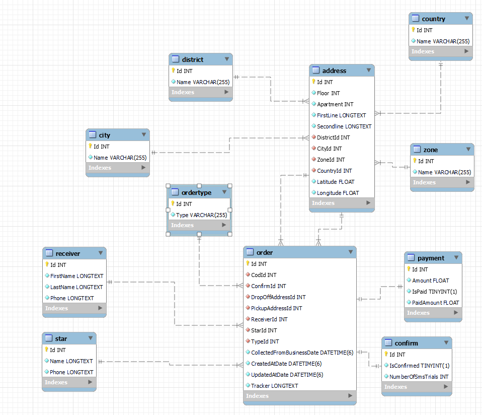

# Bosta ETL Technical Assessment

A robust ETL solution for transforming unstructured JSON data into a structured MySQL database with optimized query performance.

## Project Overview

This project implements a complete ETL pipeline that handles delivery order data, transforming it from JSON format into a well-structured relational database model. The project is split into two main components:

## Database Model



The database follows a normalized design with the following key entities:

- Order
  - Address
    - City
    - Country
    - District
    - Zone
  - Receiver
  - Payment
  - Confirm
  - Star
  - OrderType

### Model Justification

- **Normalized Structure**: The database is designed with proper normalization to eliminate data redundancy
- **Clear Relationships**: Implemented foreign key constraints ensure data integrity
- **Scalable Order Processing**: Separate tables for order details, payments, and confirmations

## Data Transformation Strategy

### JSON Flattening Technique

The solution employs a hierarchical flattening approach where:

1. Complex nested JSON objects are broken down into separate entities
2. Relationships are maintained through foreign keys

### ETL Process

1. JSON data loading
2. Initial data transformation using [extract](./extract.py) to transform JSON a format suitable for API consumption
3. A .NET Web API that receives the transformed data and commits the records to a MySQL database
4. Python service reads back the data from the database and save them to a CSV file

**Note**: The ETL process is controlled by [main](./main.py)

## Setup Instructions

1. Clone the repository
2. Configure MySQL connection string
3. Run migrations:

```bash
dotnet ef database update
```
4. Run the Python script:
```bash
python main.py
```
